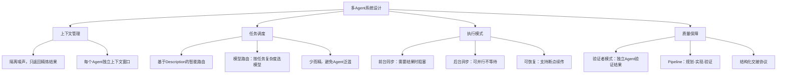

# Cursor Subagent 系统分析与多 Agent 系统设计启发

> 来源：[Cursor Subagents 文档](https://cursor.com/docs/subagents)

## 一、Cursor Subagent 系统核心概念

Cursor 的 Subagent 是一种**任务委托（Task Delegation）架构**：主 Agent 遇到复杂任务时，派生专门的子 Agent 在独立上下文中完成工作，最终将精炼结果返回给主 Agent。

四大核心特性：

| 特性 | 说明 |
|------|------|
| **上下文隔离** | 每个子 Agent 有独立的上下文窗口，避免撑爆主 Agent 的上下文 |
| **并行执行** | 多个子 Agent 可同时启动，提升吞吐量 |
| **专业化分工** | 每个子 Agent 可配置独立的提示词、工具集、模型 |
| **可复用性** | 定义一次，跨项目使用 |

### 三个内置子 Agent

| 子 Agent | 职责 | 独立运行的原因 |
|----------|------|----------------|
| **Explore** | 代码库搜索与分析 | 搜索产生大量中间结果，会污染主上下文 |
| **Bash** | 执行 Shell 命令 | 命令输出往往冗长 |
| **Browser** | 通过 MCP 控制浏览器 | DOM 快照和截图非常嘈杂 |

共同特征：它们都会产生**噪声大、体积大的中间输出**，需要子 Agent 过滤后只返回关键信息。

---

## 二、架构设计上的关键启发

### 2.1 上下文管理是核心问题

设计多 Agent 系统时，"为什么要拆分"的首要考量不应该是功能分工，而是**信息密度和上下文效率**。子 Agent 的核心价值在于：

- 吸收大量原始信息（搜索结果、命令输出、DOM 快照）
- 过滤噪声
- 只向上层返回精炼的、可操作的结果

这避免了主 Agent 上下文被无关信息淹没的问题。

### 2.2 前台 vs 后台的双模式执行

| 模式 | 行为 | 适用场景 |
|------|------|----------|
| **前台（Foreground）** | 阻塞等待，返回结果后继续 | 存在数据依赖的顺序任务 |
| **后台（Background）** | 立即返回，子 Agent 独立工作 | 长时间运行或可并行的任务 |

Agent 系统需要区分**同步依赖**和**异步并行**两种任务关系。不是所有任务都需要等待结果。

### 2.3 模型路由 —— 不同任务用不同模型

Explore 子 Agent 默认使用更快更便宜的模型，因为搜索任务不需要最强的推理能力。

这意味着多 Agent 系统中，每个 Agent 不必绑定同一个 LLM，应该根据任务复杂度做**模型路由（Model Routing）**：

- 简单检索/过滤任务 → 快速便宜模型（如 GPT-4o-mini、Claude Haiku）
- 复杂推理/决策任务 → 强力模型（如 GPT-4o、Claude Opus）

直接影响成本控制和响应速度。

---

## 三、Agent 设计模式

### 3.1 验证者模式（Verifier Pattern）

独立 Agent 专门验证其他 Agent 的工作是否真正完成。核心原则：

> "Do not accept claims at face value. Test everything."

工作流程：
1. 识别声称已完成的工作
2. 检查实现是否真实存在且可运行
3. 运行相关测试或验证步骤
4. 查找可能遗漏的边界情况

**价值**：AI 系统存在"幻觉完成"问题（声称做完了但实际没有）。独立验证 Agent 是解决信任问题的有效手段，类似软件工程中的 Code Review / QA。

### 3.2 编排者模式（Orchestrator Pattern）

```
Planner（规划） → Implementer（实现） → Verifier（验证）
```

这是经典的 **Pipeline 架构**，关键在于每个阶段之间的**交接协议（Handoff Protocol）**——上游 Agent 的输出格式必须是下游 Agent 可理解的结构化数据。

### 3.3 专家委员会模式（Expert Panel）

多个专业子 Agent 并行工作，各自负责一个维度：

- **Debugger**：根因分析、最小修复、验证方案
- **Test Runner**：自动运行测试、分析失败、修复问题
- **Security Auditor**：检查注入、XSS、硬编码密钥等安全漏洞

类似于 **Multi-Agent Ensemble** 模式，从不同角度审视同一个问题，提升整体质量。

---

## 四、工程实践启发

### 4.1 声明式 Agent 定义 —— Agent as Code

Cursor 用 **Markdown + YAML Frontmatter** 定义子 Agent：

```markdown
---
name: security-auditor
description: Security specialist. Use when implementing auth, payments, or handling sensitive data.
model: inherit
---

You are a security expert auditing code for vulnerabilities.
（系统提示词...）
```

配置字段：

| 字段 | 说明 |
|------|------|
| `name` | 唯一标识符，小写字母+连字符 |
| `description` | 何时使用此 Agent 的描述，**调度的核心依据** |
| `model` | 使用的模型：`fast`、`inherit` 或具体模型 ID |
| `readonly` | 是否限制写权限 |
| `background` | 是否后台运行 |

**启发**：Agent 的配置应该是**声明式的、版本可控的、人类可读的**。这种"Agent as Code"理念使得 Agent 定义可以纳入 Git 版本控制，团队共享。

### 4.2 Description 是路由的关键

> "The description field determines when Agent delegates to your subagent."

主 Agent 靠 `description` 决定何时委托任务给哪个子 Agent。这和 Tool Use 中的 tool description 是同一个道理。

**启发**：多 Agent 系统中，**Agent 选择/路由**是核心问题。每个 Agent 的自我描述质量直接决定调度准确性。好的描述应该明确说明：
- 这个 Agent 擅长什么
- 什么场景下应该使用它
- 它不适合处理什么

### 4.3 反模式警示

| 反模式 | 问题 | 正确做法 |
|--------|------|----------|
| 创建几十个模糊的通用 Agent | 调度器无法有效选择 | 从 2-3 个聚焦的 Agent 开始 |
| Description 太笼统（"用于一般任务"） | 毫无路由信息量 | 明确场景："用于 OAuth 认证流程实现" |
| Prompt 过长（2000+ 字） | 不会更聪明，只会更慢更贵 | 简洁直接，聚焦核心指令 |
| 简单任务也用子 Agent | 启动开销不值得 | 简单任务直接在主 Agent 完成 |

**核心原则**：Agent 数量不是越多越好，每个 Agent 应该有**清晰的边界和明确的触发条件**。"少而精"优于"多而泛"。

### 4.4 子 Agent vs 其他机制的选择

| 使用子 Agent 的场景 | 使用其他机制的场景 |
|---------------------|---------------------|
| 需要上下文隔离的长任务 | 单一用途的快速操作（用 Skill） |
| 多任务并行执行 | 简单可重复动作（用 Skill） |
| 需要多步骤的专业处理 | 一次性完成的任务（用 Skill） |
| 需要独立验证工作成果 | 不需要独立上下文窗口的任务 |

---

## 五、总结：多 Agent 系统设计思维框架



### 一句话总结

设计多 Agent 系统的核心不是"让每个 Agent 更强"，而是**如何高效地分工、通信和验证**——这和人类团队协作的原则完全一致。

### 可落地的行动项

1. **先从 2-3 个专注的 Agent 开始**，而不是一上来就设计庞大的 Agent 网络
2. **投入精力写好 Description**，这是自动路由的核心
3. **引入验证者 Agent**，解决 AI 系统的"幻觉完成"问题
4. **按任务复杂度做模型路由**，平衡成本和质量
5. **定义清晰的交接协议**，确保 Agent 间通信的结构化和可靠性
