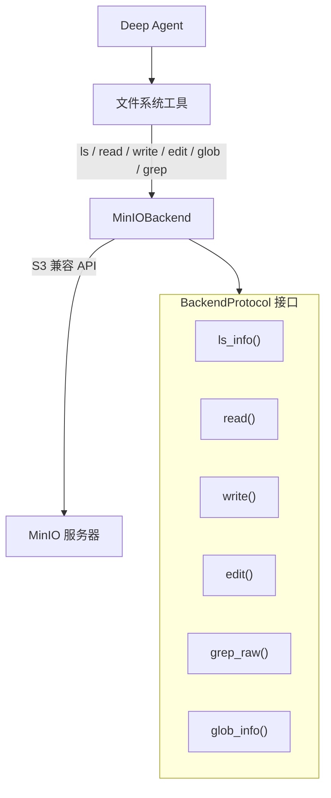
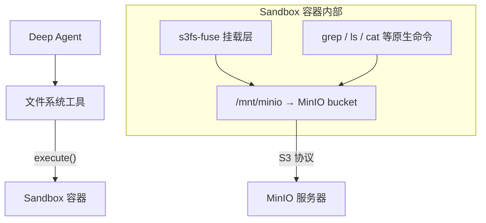
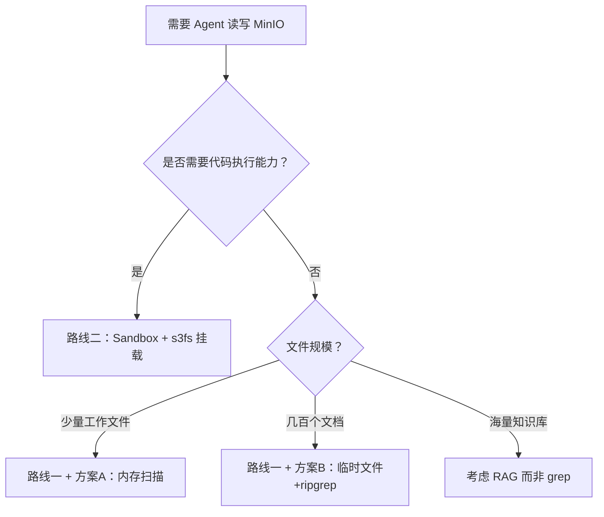

# MinIO Backend 可行性分析

> 来源：[Deep Agents Backends](https://docs.langchain.com/oss/python/deepagents/backends) | [Deep Agents Sandboxes](https://docs.langchain.com/oss/python/deepagents/sandboxes)

Deep Agents 的 Backend 体系是可插拔的，通过实现 `BackendProtocol` 接口，可以将底层存储替换为任意系统。本文分析使用 MinIO（S3 兼容对象存储）作为 Backend 的可行性，涵盖两条技术路线：自定义 BackendProtocol 实现和 Sandbox + 文件系统挂载。

---

## 一、结论

**完全可行。** MinIO 是 S3 兼容的对象存储服务，文档中已明确提供 S3 风格 Backend 的示例轮廓。MinIO 不原生支持的操作（grep、glob、edit）可以通过客户端逻辑弥补，这也是 BackendProtocol 设计时就预期的。

---

## 二、架构概览



Agent 以为自己在操作文件系统，实际上所有数据存储在 MinIO 中。这种抽象让同一套 Agent 代码既能在本地开发时读写磁盘，也能在生产环境中读写对象存储。

---

## 三、MinIO 原生能力 vs BackendProtocol 需求

| BackendProtocol 方法 | MinIO 原生支持？ | 实现方式 |
|---|---|---|
| `ls_info()` | 原生支持 | `list_objects()` 列出对象，支持前缀和分隔符模拟目录 |
| `read()` | 原生支持 | `get_object()` 获取内容，客户端侧按行切分 |
| `write()` | 原生支持 | `put_object()` 写入对象 |
| `edit()` | **不支持** | get → 修改 → put 三步完成（对象存储没有原地编辑） |
| `glob_info()` | **不支持** | `list_objects()` 拿到全部 key 后，客户端侧用 `fnmatch` 过滤 |
| `grep_raw()` | **不支持** | 需客户端实现，有三种方案（见第四章） |

MinIO 不支持 grep/glob/edit 是对象存储的天然特性，BackendProtocol 的设计就是为这种场景准备的。文档中 S3 示例的注释明确写道：

> `grep_raw`: "Optionally filter server-side; **else list and scan content**"

---

## 四、grep_raw() 的三种实现方案

这是 MinIO Backend 中最值得讨论的方法，因为它涉及在没有服务端搜索能力的情况下实现全内容正则匹配。

### 方案 A：纯内存扫描

从 MinIO 下载文件内容到内存，用 Python `re` 模块逐行匹配。

```python
def grep_raw(self, pattern, path=None, glob=None):
    objects = self._list_matching(path, glob)
    matches = []
    for obj in objects:
        content = self.client.get_object(self.bucket, obj).read().decode()
        for i, line in enumerate(content.splitlines(), 1):
            if re.search(pattern, line):
                matches.append(GrepMatch(path=obj, line=i, text=line))
    return matches
```

- 零磁盘 IO，数据始终在内存
- 不依赖外部工具
- 适合文件量少的场景

### 方案 B：临时文件 + ripgrep

将文件下载到临时目录，调用 ripgrep 执行搜索，再映射回 MinIO 路径。

```python
def grep_raw(self, pattern, path=None, glob=None):
    with tempfile.TemporaryDirectory() as tmpdir:
        for obj in self._list_matching(path, glob):
            local_path = os.path.join(tmpdir, obj.lstrip("/"))
            os.makedirs(os.path.dirname(local_path), exist_ok=True)
            self.client.fget_object(self.bucket, obj, local_path)

        result = subprocess.run(
            ["rg", "--json", pattern, tmpdir],
            capture_output=True, text=True
        )
        return self._parse_rg_output(result.stdout, tmpdir)
```

- 利用 ripgrep 的高性能（Rust 实现，多线程并行扫描）
- 正则语法和 `FilesystemBackend` 一致（它底层也用 ripgrep）
- 多了一轮磁盘写入 + 读取的开销

### 方案 C：搜索引擎层

写入时同步建索引，查询时走搜索引擎，不再全量扫描。

```python
def write(self, file_path, content):
    self.client.put_object(self.bucket, self._key(file_path), ...)
    self.search_engine.index(doc_id=file_path, content=content)

def grep_raw(self, pattern, path=None, glob=None):
    hits = self.search_engine.search(query=pattern, path_filter=path)
    return [GrepMatch(path=h.id, line=h.line, text=h.text) for h in hits]
```

可选的搜索引擎：

| 搜索引擎 | 特点 | 适合场景 |
|---|---|---|
| **Elasticsearch** | 全文检索 + 正则、倒排索引、成熟生态 | 通用文本搜索，正则匹配 |
| **Apache Doris** | 列存分析型数据库，支持全文检索 | 已有 Doris 基础设施时 |
| **Meilisearch / Typesense** | 轻量级，部署简单 | 文件量中等，不想运维 ES 集群 |
| **SQLite FTS5** | 零依赖，嵌入式 | 单机场景，最简方案 |

**方案 C 的关键限制**：`grep_raw()` 接收的是正则表达式，而搜索引擎擅长的是全文检索（分词匹配），两者语义不同。应对方式：

1. **限定只支持关键词搜索**，放弃完整正则（大多数 Agent 场景够用）
2. **两阶段查询**：搜索引擎粗筛候选文件 → 对候选文件做精确正则匹配
3. **用 ES 的 regexp 查询**（ES 支持正则，但性能远不如倒排索引查询）

### 方案选择建议


| 场景 | 推荐方案 | 原因 |
|---|---|---|
| Agent 工作文件（几十个、几 KB） | A | 文件少，`re` 足够快，省去额外开销 |
| 几百个文档 | B | ripgrep 多线程优势明显 |
| 海量知识库 / 毫秒级响应 | C | 但此时更应考虑是否该用 RAG（向量检索）而不是 grep |

> 到了方案 C 的规模，`grep_raw()` 可能已经不是正确的抽象了——语义搜索（RAG）比逐行正则匹配更适合大规模知识检索。

---

## 五、路径映射策略

Agent 看到的是类似 `/workspace/plan.md` 的路径，需要映射到 MinIO 的 bucket + object key：

- **Bucket**：配置时指定，例如 `agent-files`
- **Prefix**：可选前缀，例如 `session-123/`
- Agent 路径 `/workspace/plan.md` → MinIO key: `session-123/workspace/plan.md`

---

## 六、协议实现要点

- `write()` 必须实现 **create-only** 语义——文件已存在时返回错误，而不是覆盖
- `grep_raw()` 对无效正则返回错误字符串，**不抛异常**
- 外部 Backend 的 `files_update` 一律返回 `None`（只有 StateBackend 等内存型 Backend 才使用 `files_update`）
- `read()` 返回带行号的内容格式
- MinIO 的 `list_objects` 可以用 `recursive=False` + 分隔符模拟目录层级

---

## 七、与 CompositeBackend 组合

MinIOBackend 可以与其他 Backend 组合使用，通过路径前缀路由：

```python
composite = lambda rt: CompositeBackend(
    default=StateBackend(rt),           # 默认：临时空间
    routes={
        "/data/": MinIOBackend(...),    # /data/ 路径：MinIO
        "/memories/": StoreBackend(rt), # /memories/ 路径：持久化
    }
)
```

这样 Agent 的临时工作文件走 State，需要持久化的数据走 MinIO，长期记忆走 Store，各取所长。

---

## 八、替代方案：Sandbox + s3fs 挂载

> 来源：[Deep Agents Sandboxes](https://docs.langchain.com/oss/python/deepagents/sandboxes)

除了自定义 BackendProtocol，还有一条完全不同的技术路线：利用 Sandbox Backend 的架构特性，在沙箱内部将 MinIO 挂载为本地文件系统。

### 8.1 为什么 Sandbox 能解决这个问题

Sandbox Backend 的核心设计是：提供方只需实现一个 `execute()` 方法（执行 shell 命令），所有文件系统操作（`read`、`write`、`edit`、`ls`、`glob`、`grep`）都由 `BaseSandbox` 基类通过调用 `execute()` 自动构建。

换言之，Sandbox 内部的 `grep` 就是真正的 `grep`/`ripgrep`，`ls` 就是真正的 `ls`。如果在 Sandbox 内部把 MinIO 挂载为本地文件系统，所有工具就自动生效，**不需要实现任何 BackendProtocol 方法**。

### 8.2 架构



在 Sandbox 的 Docker 镜像中预装 `s3fs-fuse`，启动时把 MinIO bucket 挂载到本地路径（如 `/mnt/data`），之后 Agent 的所有文件操作都透明地落到 MinIO 上。同时 Agent 还能使用 `execute` 工具执行任意 shell 命令（如 `mc` CLI 操作 MinIO、运行脚本等）。

### 8.3 两条路线对比

| 维度 | 路线一：自定义 MinIOBackend | 路线二：Sandbox + s3fs 挂载 |
|---|---|---|
| **实现复杂度** | 需自己实现 6 个 BackendProtocol 方法 | 只需配置 Docker 镜像 + 挂载命令 |
| **grep 实现** | 客户端模拟（内存扫描 / ripgrep / 搜索引擎） | 原生 `grep`/`rg`，操作系统级性能 |
| **edit 实现** | get → 修改 → put 三步模拟 | 原生文件编辑，FUSE 层透明处理 |
| **隔离性** | 无隔离，Agent 和应用同进程 | 完全隔离，Agent 在沙箱内运行 |
| **额外能力** | 仅文件操作 | 文件操作 + `execute` 工具（可运行任意 shell） |
| **网络延迟** | 每次 API 调用有 MinIO 网络开销 | FUSE 层有缓存，`execute()` 有网络开销 |
| **部署依赖** | 仅需 `minio` Python SDK | 需要 Sandbox 提供方（Modal / Daytona / Runloop）或自建容器 |
| **适合场景** | 轻量集成，不需要代码执行 | 需要代码执行 + 文件读写的完整开发环境 |

### 8.4 选择建议

**选 Sandbox 的理由**：
- 零自定义代码——不需要实现 BackendProtocol，`grep`/`glob`/`edit` 全部原生可用
- Agent 还能用 `execute` 跑 shell 命令
- 天然的安全隔离，Agent 无法访问宿主机

**不选 Sandbox 的理由**：
- 引入了一整个容器化基础设施（需要 Sandbox 提供方或自建容器环境）
- 如果只需要文件读写，不需要代码执行，Sandbox 太重了
- s3fs-fuse 有已知的性能和一致性限制（不适合高并发写入，元数据操作较慢）

### 8.5 s3fs-fuse 的局限性

s3fs-fuse 将对象存储模拟为 POSIX 文件系统，但两者有本质差异：

- **rename 不是原子操作**：实际是 copy + delete，大文件 rename 很慢
- **无真正的目录**：目录是通过 key 前缀模拟的，`mkdir` 创建的是零字节占位对象
- **一致性延迟**：写入后立即读取可能拿到旧数据（取决于 MinIO 配置）
- **元数据操作慢**：`ls` 大目录比本地文件系统慢很多，因为每次都要请求 S3 API

对于 Agent 的典型使用模式（少量小文件、顺序读写），这些限制通常不会成为问题。

---

## 九、总结



两条路线不互斥。可以用 CompositeBackend 组合：临时工作文件走 StateBackend，MinIO 数据走自定义 MinIOBackend 或 Sandbox，长期记忆走 StoreBackend。

---

## 十、依赖

| 路线 | 所需依赖 |
|---|---|
| 路线一：自定义 MinIOBackend | `minio`（MinIO Python SDK）或 `boto3`（S3 兼容）+ `deepagents` |
| 路线二：Sandbox + s3fs | Sandbox 提供方 SDK（`langchain-modal` / `langchain-daytona` / `langchain-runloop`）+ `deepagents` + Docker 镜像中安装 `s3fs-fuse` |
