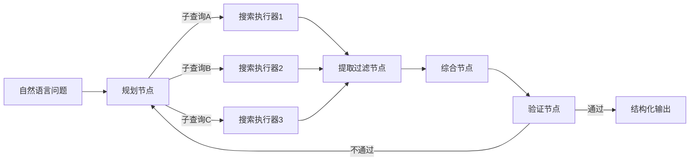
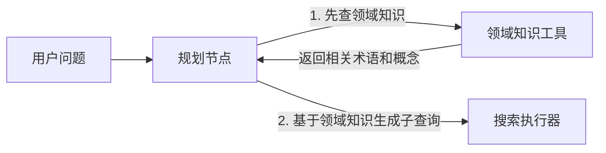
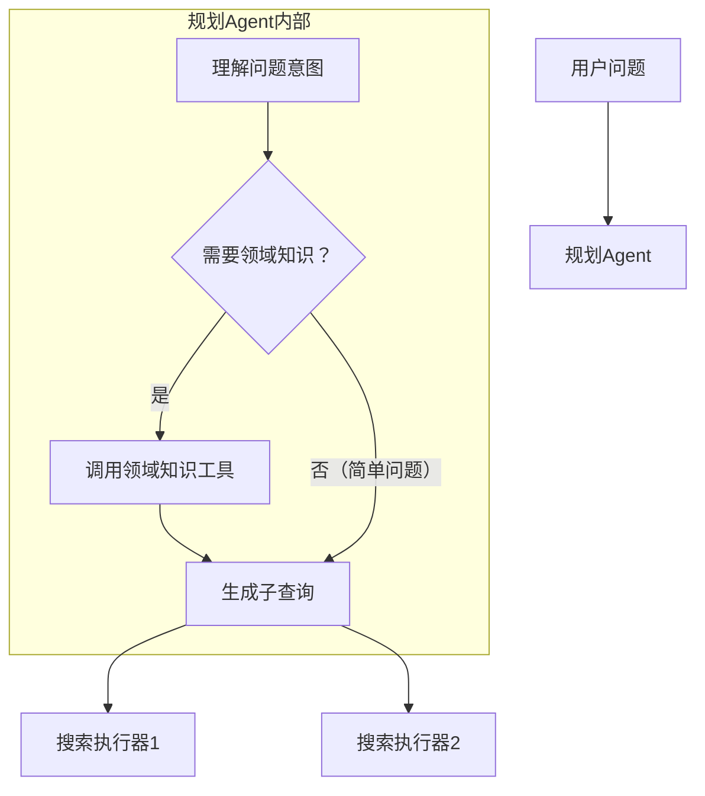

# 搜索 Agent 设计思路

## 一、搜索 Agent 的定位

搜索 Agent 是一个**自包含的能力单元**：

- **对外**：接收一个自然语言问题，返回结构化的搜索结果（带引用来源）。调用方不需要知道内部如何实现。
- **对内**：由多个节点组成的完整工作流，在 LangGraph 中表现为一个 Subgraph。

在更大的系统中（如同时包含代码 Agent、数据分析 Agent 的编排系统），搜索 Agent 就是一个黑盒子。编排器只需告诉它"帮我查一下 X"，它自己负责怎么查、查几次、怎么验证。

```
编排层：  用户问题 → 编排Agent → 搜索Agent / 代码Agent / ...
搜索Agent内部：  规划 → 并行搜索 → 提取过滤 → 综合 → 验证 → 输出
```

### 搜索 Agent 的输入与输出

| | 说明 |
|---|---|
| **输入** | 一个完整的信息需求（自然语言），例如"对比 LangChain 和 LlamaIndex 在 Agent 实现上的区别" |
| **输出** | 结构化的搜索结果，包含摘要、关键信息、来源 URL |

搜索 Agent 收到的是**原始问题**，而不是已经拆好的查询词。查询分解是它内部的能力，不是外部编排器的职责。

> 类比：你作为领导给下属说"帮我调研一下竞品的定价策略"，而不是说"先搜 A 公司定价，再搜 B 公司定价，然后对比"。具体怎么搜是下属的专业能力。

---

## 二、内部架构

### 2.1 整体流程



### 2.2 各节点职责

| 节点 | 职责 | 是否需要 Agent | 运行模式 | 模型选择 |
|------|------|---------------|----------|----------|
| **规划节点** | 理解问题意图，拆分为多个子查询，制定检索策略 | 看复杂度 | 前台同步 | 强模型 |
| **搜索执行器**（多个） | 接收一个子查询，调用搜索 API，返回原始结果 | 否（纯执行） | **前台并行** | 快模型 / 纯函数 |
| **提取过滤节点** | 去噪、提取正文、判断相关性 | **否**（一次 LLM 调用） | 前台同步 | 快模型 |
| **综合节点** | 多源信息整合，结构化输出 | 看复杂度 | 前台同步 | 强模型 |
| **验证节点** | 事实校验、矛盾检测、质量判断 | 是（需要自主决策） | 前台同步 | 强模型 |

### 2.3 判断"Agent"还是"节点"的标准

> 如果一个步骤是"输入 → 固定处理逻辑 → 输出"，它就是一个**节点**；如果它需要自主决策、动态调用工具、可能有多轮循环，它才需要是一个 **Agent**。

---

## 三、关键职责边界

### 3.1 搜索执行器：只执行，不分解

搜索执行器接收的是**一个已经拆好的子查询**，它的职责只有：

1. 拿到子查询字符串
2. 调用搜索 API
3. 返回原始结果

它**不负责**理解问题、分解查询、判断结果质量。

理由：分解问题需要强模型做推理，执行搜索只需要调 API。职责分离后，可以对两个步骤使用不同复杂度的模型。

### 3.2 提取过滤：不需要独立 Agent

提取过滤只是"提示词 + 数据输入 → 清洗后的输出"，在 LangGraph 中就是一个普通节点，用一个函数实现即可。没有自主决策、没有工具调用、没有循环——启动一个独立 Agent 的开销完全不值得。

### 3.3 查询分解归属规划节点

"怎么拆搜索查询"是搜索领域的专业知识（关键词组合策略、是否加时间范围、选哪个搜索源）。这个能力属于搜索 Agent 内部的规划节点，不属于外部编排器。

### 3.4 搜索执行器的运行模式：前台并行，而非后台

多个搜索执行器可以**并行**运行（同时搜索不同子查询），但后续的提取过滤节点**必须等待所有搜索结果返回**才能开始。因此是"前台并行"——同时发出，阻塞等待全部完成。

"后台执行"只适用于不依赖结果的场景（如异步日志、通知推送），搜索结果是后续所有步骤的输入，不可能不等。

---

## 四、LangChain 实现方案

### 4.1 技术选型：LangGraph

| 候选 | 是否适合 | 理由 |
|------|---------|------|
| **LangChain** | 不够 | 简单的 ReAct 循环无法表达条件回退、并行搜索、多分支等复杂流程 |
| **LangGraph** | **最佳** | 原生支持图结构（节点 + 条件边 + 并行），状态持久化，与 LangChain 工具集兼容 |
| **Deep Agents SDK** | 不推荐 | 抽象层级太高，搜索策略和验证逻辑需要精细定制；学习价值较低 |

LangGraph 和 LangChain 可以搭配使用：LangGraph 做编排骨架，LangChain 提供工具和模型集成。

### 4.2 使用中间件优化：总结中间件

对于较简单的搜索场景（不需要完整的 LangGraph 子图），可以用 LangChain 的 `create_agent` + 中间件实现：

```python
from langchain.agents import create_agent
from langchain.agents.middleware import (
    wrap_tool_call,
    ModelCallLimitMiddleware,
    SummarizationMiddleware,
)
from langchain.tools.tool_node import ToolCallRequest
from langchain.messages import ToolMessage
from typing import Callable
from langgraph.types import Command


@wrap_tool_call
def summarize_search(
    request: ToolCallRequest,
    handler: Callable[[ToolCallRequest], ToolMessage | Command],
) -> ToolMessage | Command:
    """用快模型总结搜索工具返回的原始结果，减少主模型上下文负担。"""
    result = handler(request)
    if request.tool_call["name"] == "web_search":
        summary = fast_model.invoke(
            f"请提取以下搜索结果中与查询相关的关键信息，"
            f"去除无关内容：\n\n{result.content}"
        )
        return ToolMessage(
            content=summary.content,
            tool_call_id=result.tool_call_id,
        )
    return result


agent = create_agent(
    model="gpt-4.1",
    tools=[web_search_tool],
    middleware=[
        summarize_search,
        ModelCallLimitMiddleware(run_limit=10),
        SummarizationMiddleware(
            model="gpt-4.1-mini",
            trigger=("tokens", 4000),
        ),
    ],
)
```

在这个方案中：

- **主模型（强模型）** 负责规划（决定搜什么）和验证（评估结果是否足够）
- **搜索工具** 调用搜索 API 获取原始结果
- **总结中间件（`wrap_tool_call`）** 用快模型压缩原始结果，减少上下文消耗
- **Agent Loop** 自然完成验证——主模型每轮都会评估搜索结果，决定继续搜索还是输出

### 4.3 不需要验证中间件

验证不应该放在中间件中，原因有三：

1. **与主模型职责重叠**。Agent Loop 中主模型每一轮都会评估搜索结果，天然具备验证能力。加验证中间件等于同一环节做两次验证，冗余且增加延迟。

2. **验证失败后难以处理**。中间件里验证失败了，要么返回错误让主模型决定（和不加中间件效果一样），要么在中间件里自动重搜（中间件不应承担决策职责）。

3. **中间件的定位是横切关注点**。日志、重试、限流、PII 检测——这些是通用的、与业务逻辑无关的关注点。而"搜索结果是否回答了用户问题"是核心业务逻辑，应由主模型在 Agent Loop 中处理。

> 中间件管"怎么处理数据"，主模型管"数据够不够好"。

Agent Loop 的验证流程：

```
第1轮：主模型 → "搜索 X" → 工具执行 → 中间件总结 → 返回
第2轮：主模型评估 → "信息不够，换个角度搜 Y" → 工具执行 → 中间件总结 → 返回
第3轮：主模型评估 → "信息足够" → 输出最终回答
```

---

## 五、设计决策记录

以下是设计过程中的关键纠正和决策，记录推演过程中的思考变化。

### 决策 1：搜索执行器不应"后台运行"

**初始想法**：搜索执行器标记为"后台并行"。

**纠正**：后续的提取过滤节点依赖所有搜索结果，必须等待全部完成。正确描述是"前台并行"——同时发出，但阻塞等待全部返回。

**原则**：后台执行只适用于不依赖结果的场景。

### 决策 2：提取过滤不需要独立 Agent

**初始想法**：为提取过滤设置一个独立的 Agent。

**纠正**：提取过滤是"输入 → 固定处理 → 输出"的确定性步骤。一次 LLM 调用 + 提示词就能完成，不需要自主决策，不需要工具调用。在 LangGraph 中就是一个普通节点。

**原则**：不要把简单任务包装成 Agent，启动开销不值得。

### 决策 3：查询分解属于搜索 Agent 内部

**初始想法**：搜索执行器自己分解查询。

**纠正**：分解查询需要理解意图（强推理），执行搜索只需调 API（纯执行），两者所需能力完全不同。分解查询是规划节点的职责，搜索执行器只接收已拆好的子查询。

**原则**：按能力需求分层——推理归规划，执行归执行器。

### 决策 4：规划节点属于搜索 Agent 内部

**初始想法**：规划节点是独立于搜索 Agent 的外部组件。

**纠正**："怎么拆搜索查询"是搜索领域的专业知识，属于搜索 Agent 的内部能力。搜索 Agent 对外接收完整的自然语言问题，内部自行分解。

**原则**：领域知识内聚——编排器只需要知道"这个问题需要搜索"，不需要知道搜索内部怎么运作。

### 决策 5：验证不应放在中间件中

**初始想法**：用一个验证中间件调用模型来验证总结后的内容。

**纠正**：验证是核心业务逻辑，不是横切关注点。主模型在 Agent Loop 的每一轮中天然会评估搜索结果质量并决定下一步。加验证中间件是冗余的。

**原则**：中间件处理通用关注点（日志、重试、上下文压缩），核心决策留给主模型。

### 决策 6：领域知识注入方式的选择

**问题**：规划节点缺乏领域知识，导致查询质量低。例如用户问"RAG 优化方案"，如果不知道 RAG 的相关术语（chunking、reranking、hybrid search），就只能原样搜索。

**两个候选方案**：
- 方案 A：规划节点通过 Tool 查询领域知识库（向量搜索）
- 方案 B：用 `wrap_model_call` 中间件自动注入领域上下文到系统提示词

**选择**：根据场景决定，优先从简单方案开始演进。

**原则**：
- 单一领域 / 知识量少 → 动态提示词中间件（甚至硬编码在系统提示词中）
- 多领域 / 知识量大 → 规划节点升级为 Agent + 领域知识工具
- 演进路径：硬编码提示词 → 动态中间件 → 知识库工具

详见第七章。

---

## 六、两种实现路径总结

根据搜索 Agent 的复杂度，有两种实现路径：

### 路径 A：简单场景 —— LangChain create_agent + 中间件

适用于单轮搜索、不需要复杂并行和回退的场景。

```
create_agent(主模型) + web_search 工具 + wrap_tool_call 总结中间件
```

主模型通过 Agent Loop 自行完成规划（决定搜什么）、验证（评估结果）、输出。

### 路径 B：复杂场景 —— LangGraph 子图

适用于需要查询分解、并行搜索、条件回退、多步骤编排的场景。

```
LangGraph 图：规划节点 → 并行搜索执行器 → 提取过滤节点 → 综合节点 → 验证节点
```

每个节点可以使用不同的模型（模型路由），通过条件边实现验证回退。

两种路径不矛盾——路径 A 可以作为路径 B 的起点，先用简单方案验证可行性，再逐步演进为 LangGraph 子图。

---

## 七、领域知识注入

### 7.1 核心问题

搜索 Agent 的查询质量直接决定最终结果质量，而查询质量依赖于领域知识。

当用户问"RAG 的最新优化方案"时，规划节点需要知道：
- RAG = Retrieval-Augmented Generation
- 相关术语：chunking、reranking、hybrid search、contextual retrieval、embedding models
- 应该搜的方向：分块策略、检索增强、上下文压缩

没有领域知识，规划节点只能原样搜"RAG 优化"，效果远不如拆成多个专业子查询。

### 7.2 方案 A：规划节点通过 Tool 查询领域知识库

规划节点在生成查询前，先调用一个领域知识工具获取相关概念和术语：



实现示例：

```python
@tool
def domain_knowledge(topic: str) -> str:
    """查询领域知识库，返回相关概念、术语和搜索建议。"""
    results = vector_store.similarity_search(topic, k=5)
    return format_domain_context(results)
```

规划节点变成一个 Agent（不只是节点），它可以**主动决定**是否需要领域知识、查什么领域。

**优点**：
- 规划节点主动决定是否查询、查什么，灵活度高
- 知识库可独立维护和更新，不改 Agent 代码
- 语义检索（向量搜索）能找到概念相关而非仅字面相关的知识
- 适合**多领域**场景——同一个 Agent 可以处理 AI、金融、医疗等不同领域

**缺点**：
- 多一次工具调用（可能还有一次模型调用），增加延迟
- 规划节点从"普通节点"升级为"Agent"，复杂度增加
- 需要建设和维护领域知识库

### 7.3 方案 B：动态提示词中间件

用 `wrap_model_call` 中间件，在每次模型调用前自动注入领域上下文：

```python
from langchain.agents.middleware import wrap_model_call, ModelRequest, ModelResponse
from langchain.messages import SystemMessage
from typing import Callable


@wrap_model_call
def inject_domain_context(
    request: ModelRequest,
    handler: Callable[[ModelRequest], ModelResponse],
) -> ModelResponse:
    user_query = extract_latest_query(request.messages)
    domain_context = vector_store.similarity_search(user_query, k=3)

    new_content = list(request.system_message.content_blocks) + [
        {"type": "text", "text": f"相关领域知识：\n{format_context(domain_context)}"}
    ]
    new_system = SystemMessage(content=new_content)
    return handler(request.override(system_message=new_system))
```

**优点**：
- 对主 Agent 逻辑**完全透明**，不需要改动规划逻辑
- 不增加工具调用轮次，领域知识直接注入提示词
- 符合中间件"横切关注点"的定位
- 实现简单，和 LangChain 内置的 `SummarizationMiddleware` 模式一致

**缺点**：
- **每次模型调用都会触发**——验证阶段不需要领域知识也会注入，浪费 token
- 中间件**被动匹配**（基于向量相似度），不如 Agent 主动推理精准
- 如果领域知识很多，系统提示词可能过长
- 不适合需要**多轮领域探索**的场景（比如先查大领域，再查细分方向）

### 7.4 方案对比

| 维度 | 方案 A（Tool 查询） | 方案 B（动态提示词中间件） |
|------|---------------------|---------------------------|
| 适用场景 | 多领域、知识量大 | 单一领域、知识量少 |
| 灵活度 | 高（Agent 主动决定） | 低（被动注入） |
| 延迟影响 | 多一次工具调用 | 仅增加向量搜索耗时 |
| 实现复杂度 | 较高（需建知识库，规划节点升级为 Agent） | 较低（中间件 + 向量搜索） |
| Token 效率 | 高（只在需要时查询） | 低（每次模型调用都注入） |
| 精准度 | 高（主动推理 + 语义检索） | 中（仅语义检索匹配） |

### 7.5 推荐方案：知识增强的规划节点

对于需要专业搜索的场景，推荐方案 A 的改良版——规划节点自己决定是否需要查领域知识：



关键点：简单问题（"今天北京天气"）不需要领域知识直接搜；专业问题（"对比 RLHF 和 DPO 的训练效率"）先查领域知识再拆查询。

领域知识库最小可行方案：

```python
domain_entries = [
    {
        "topic": "RAG",
        "full_name": "Retrieval-Augmented Generation",
        "related_terms": ["chunking", "embedding", "reranking", "hybrid search"],
        "search_tips": "搜索时区分 naive RAG / advanced RAG / modular RAG"
    },
]
```

存入向量数据库，规划节点通过语义搜索找到最相关的条目。

### 7.6 渐进演进路径

不必一步到位。推荐从简单方案开始，按需升级：

```
阶段1：硬编码提示词
  └─ 在系统提示词中直接写入几条领域知识
  └─ 零成本启动，验证搜索效果

阶段2：动态提示词中间件
  └─ wrap_model_call + 向量搜索，自动注入相关领域上下文
  └─ 不改 Agent 架构

阶段3：知识增强的规划节点
  └─ 规划节点升级为 Agent，配备 domain_knowledge 工具
  └─ 主动决定何时查询、查什么领域
  └─ 建设完整的领域知识库
```

每个阶段都是可用的，不需要等到阶段 3 才能上线。先跑起来，观察查询质量瓶颈，再决定是否升级。
